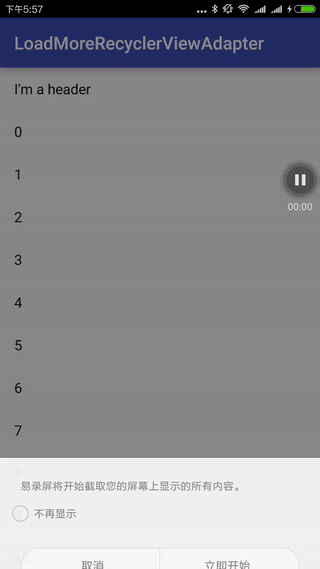

# LoadMoreRecyclerViewAdapter

***

作者：田野光(https://wangyeming.github.io/)

欢迎捐赠：

***

支持上拉加载的RecyclerView的基类Adapter，简单易用，可以看做[CymChad/BaseRecyclerViewAdapterHelper](https://github.com/CymChad/BaseRecyclerViewAdapterHelper)
的超级精简版。只保留了上拉加载的效果和一些常用方法，最大程度简化代码。

推荐另外一个我的上拉开源项目[wangyeming/SuperSwipeRefreshLayout](https://github.com/wangyeming/SuperSwipeRefreshLayout),两种属于风格完全不同的上拉加载，实现机制也完全不同。
比较常见的还是该项目中的样式。

## 实现原理：

   通过封装RecyclerView基类的Adapter，在adapter中人为的添加footer，这里仅仅是我的一种实现方式，仅供参考。

## 用法：
    
* 实现抽象的LoadMoreView，也就是上拉加载的自定义View的样式，包括加载态，网络失败样式，没有更多样式等。
* 继承LoadMoreAdapter，实现自己的adapter，例如：

        public class CustomAdapter extends LoadMoreAdapter<Integer> {
    
            public CustomAdapter(Context context) {
                super(context, android.R.layout.simple_list_item_1);
            }
    
    
            @Override
            protected void convert(BaseViewHolder holder, Integer item, int indexOfData) {
                holder.setText(android.R.id.text1, String.valueOf(item));
            }
        }
        
是不是很简单？

* 最后在项目中使用即可

            mAdapter = new CustomAdapter(this);
            mAdapter.setLoadMoreView(new CommonLoadMoreView(this));     //自定义上拉样式
            mAdapter.setData(mData);
            mAdapter.setLoadMoreEnable(true);       //启用上拉加载
            mAdapter.setHeaderView(vHeader);        //设置header
            mAdapter.setEmptyView(vEmpty);          //设置empty
            mAdapter.setOnLoadMoreListener(this);   //设置上拉的监听
            mAdapter.setHeaderShowInEmpty(true);    //设置同时显示header和empty
            mAdapter.setOnRecyclerViewItemClickListener(this);  //设置点击监听
            
是不是很简单？:-D
    

